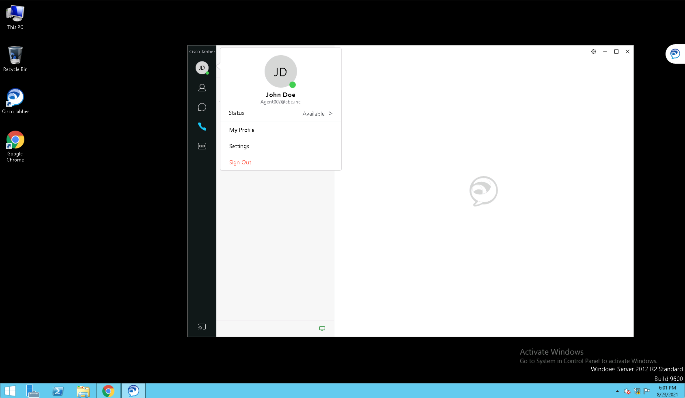

# GVE Devnet Agent State Change Finesse Toaster Notification Gadget
Sample Finesse Gadget that uses a Toaster Notification to indicate a change in Agent state triggered by 
the agent's phone line going out or coming back in service.


## Contacts
* Gerardo Chaves (gchaves@cisco.com)

## Solution Components
* UCCX
* Finesse

## Installation/Configuration

The steps below are derived from the Cisco DevNet Learning Lab that teaches you 
how to add a custom Finesse Gadget to the Agent Desktop:
https://developer.cisco.com/docs/finesse/#!add-a-finesse-gadget/finesse-add-a-finesse-gadget-to-the-agent-desktop  

Those instructions have screenshots based on one of the UCCX 11 sandboxes, but other than the way the gadget looks on 
the screen and the Finesse Admin pages to configure it the instructions should be relevant.   

Below please find a shorter version of those instructions:  

### Reserve and start a DevNet UCCX Sandbox

Go to https://devnetsandbox.cisco.com/RM/Topology and reserve a UCCX Sandbox. The screenshots below refer to the 
Unified Contact Center Express 12.5-SU1 sandbox, but you can reserve the 11.6 or 12.0 version; the credentials, commands 
and URLs are the same. 

### Connect to sandbox  
Once you receive the email with the subject "Your Cisco DevNet Sandbox Lab is Ready" from the sandbox, follow the instructions 
in the email body to VPN into it with a Cisco AnyConnect client. 

### Register the agent phones  
Register the Agent Phones by launching Jabber in the Jabber 2 desktop from the topology map in the sandbox
web page (URL is in your the email you received). 

To launch the desktop, just hover your mouse pointer over the rectangle with the Jabber logo for the Jabber 2 
virtual machine and, from the button that pops up with an inverse triangle icon a pop-up menu shows where you can select 
the RDP menu entry. 


This will open a new browser tab where you will see a Windows Server VM interface with a Cisco Jabber 
Desktop shortcut which you can double click to start Jabber on that VM.  

  

NOTE: You can also just run a local Remote Desktop Client on your PC and use the IP address of the Jabber 2 VM (10.10.20.13) and the login credentials from the Admin tab in the sandbox 
dashboard (Username: administrator , Password: ciscopsdt) to connect to it that way. 

### Enable the 3rdpartygadget account:

From a terminal window on your PC, execute the following commands: 
```
% ssh -l administrator hq-uccx.abc.inc
administrator@hq-uccx.abc.inc's password: ciscopsdt

Command Line Interface is starting up, please wait ...

   Welcome to the Platform Command Line Interface

VMware Installation:
	2 vCPU: Intel(R) Xeon(R) CPU E5-4669 v4 @ 2.20GHz
	Disk 1: 146GB, Partitions aligned
	10240 Mbytes RAM

admin:utils reset_3rdpartygadget_password
New Password: ciscocisco
Confirm New Password: ciscocisco
Updating password for 3rdpartygadget...

Password updated successfully.
admin:exit

Connection to hq-uccx.abc.inc closed.
% 

```

NOTE: After making changes to the source code of a gadget it is very likely they will not be reflected 
on the Finesse desktop even after page reload, clearing browser cache and agent sign out/ sign in.  
To be sure the changes you made will be reflecetd, you must restart the finesse server using the following command 
also while connected to the UCCX server CLI:  

```
admin:utils service restart Cisco Finesse Tomcat
 Don't press Ctrl-c while the service is getting RESTARTED.If Service has not Restarted Properly, execute the same Command Again
Service Manager is running
Cisco Finesse Tomcat[STOPPING]  
Cisco Finesse Tomcat[STOPPING]  
Cisco Finesse Tomcat[STARTING]  
Cisco Finesse Tomcat[STARTING]  
Cisco Finesse Tomcat[STARTING]  
Cisco Finesse Tomcat[STARTING]  
Cisco Finesse Tomcat[STARTING]  
Cisco Finesse Tomcat[STARTED]  
Cisco Finesse Tomcat[STARTED]  
admin:

```

### Set the Toaster Notification auto close duration 
In your local copy of the `ToasterNotification.js` inside the ToasterNotification folder you downloaded from this repository , change the `TOASTER_AUTOCLOSE_TIMER` constant to 
whatever value you prefer. In the sample code it is set to 20,000 milliseconds (20 seconds). The default if you do not sepecify the `autoClose` parameter when calling `finesse.containerservices.FinesseToaster.showToaster()` is 
8 seconds. There are 3 locations in the code that use that constant so if you prefer to have different close durations for the different type of Toaster 
notifications (line issues, Finesse Out of Service and Finesse back in Service) you can just set them explicitely by replacing `TOASTER_AUTOCLOSE_TIMER`  with your prefered value.  

### Upload the ToasterNotification gadget

The following instructions are for using the [FileZilla](https://filezilla-project.org/) SFTP client to transfer the gadget from your PC to 
the Finesse server in UCCX, but you can use any other SFTP tool and use these instructions as a reference only:  

In the quickconnect bar,  

Enter the Finesse FQDN: hq-uccx.abc.inc in the Host field.  
Enter 3rdpartygadget in the Username field.  
Enter ciscocisco in the Password field. This is the 3rdpartygadget password defined in the previous step.  
Enter 22 in the Port field.  
Click Quickconnect.  

In the remote site section, confirm that you see a folder named / and you can see the files folder below  


Transfer the ToasterNotification gadget:

Drag the ToasterNotification folder (that contains the xml, js, and css) into the files folder.  

Confirm that the transfer was successful by checking that the transfers shows up in the Successful transfers tab at the bottom.

Change the file permissions of the gadget files. The gadget files have to have public read permissions for it to be loaded on the Finesse agent desktop.

Select the ToasterNotification folder.

Right-click on the ToasterNotification folder.

From the dropdown menu, select File permissions....

A Change file attributes window appears.

Under Public permissions verify that Read permissions is selected.

Select Recurse into subdirectories.

Click OK.

Confirm that you can access the gadget:

Open Chrome and go to the following URL: https://hq-uccx.abc.inc:8445/3rdpartygadget/files/ToasterNotification/ToasterNotification.xml  

If the sample gadget was uploaded successfully, you will see content of the FinesseToaster.xml file in the browser window.


### Add the gadget to the agent's desktop layout  
Open Chrome and enter the following URL to go to the Finesse Administration Console: https://hq-uccx.abc.inc:8445/cfadmin

Enter the administrator's username:  administrator in the ID field.

Enter the administrator's password: ciscopsdt in the Password field.

Click the Desktop Layout tab

Add the gadget to the Finesse desktop for users with an agent role by inserting the following XML within the 
<gadgets> tag of the <columns> tag of the tab with <id>home</id> within the layout with the Agent role:   
```<gadget hidden="true">/3rdpartygadget/files/ToasterNotification/ToasterNotification.xml</gadget>```


NOTE: If you do not specify `hidden="true"` in the opening gadget tag then you will see an empty gadget in the agents desktop. Since this is a "headless" gadget, you should be able to 
add it to any of the tabs you have specified for an Agent or Supervisor in the Finesse Admin Gadget layout editor and in any order relative to other gadgets.   

### View the desktop layout change for agent role  

On the Jabber 2 VM, launch Chrome and go to the following URL: https://hq-uccx.abc.inc:8445/desktop.

Enter UserA's username: Agent002 in the Username field.

Enter UserA's password: ciscopsdt in the Password field.

Enter UserA's extension: 6002 in the Extension field.

Click Sign In.

The ToasterNotification gadget should now be visible on the Home tab of the Finesse desktop.


## Usage

Close Cisco Jabber or otherwise make the Jabber line go out of service. Notice the Toaster notification: 


This will pop up even if the browser with the Finesse desktop is minimized or otherwise hidden:


Once the Jabber client on the VM is re-launched or otherwise goes back in service, you will see another toaster 
notification:

   

You can also test the the "Finesse server has disconnected" notification by restarting the Finesse Tomcat server as explained above.  


### Managing reason codes

This sample code only sends a notification when the agent transitions to a Not Ready state or communications to the Finesse Server is lost.
The following reason codes are also detected and included in the notification text: 
id 35: Phone Failure
id 38: Phone Working
id 9: Phone Failure
id 11: CUCM Failover
id 12: Phone Working

Code IDs 35 and 38 are configured with those reason codes in the Cisco DevNet UCCX 12.5 Sandbox and they may to Reason Codes 32759 and 32756 respectively, but your setup might have different IDs for the various reason codes.
If this sample code is not prividing the correct reason code text, access the following URL and log in with the Finnesse administrator credentials to check the mapping (for the 
UCCX 12.5 DevNet Sandbox, the uccxPublisher hostname is hq-uccx.abc.inc:   
https://{{uccxPublisher}}:8445/finesse/api/ReasonCodes?category=ALL   
The [sample_NR_reasoncodes.xml](sample_NR_reasoncodes.xml) file in the respository shows you an example of the XML file that you get from accessing that URL, it was extracted 
from the UCCX 12.5 DevNet Sandbox. You can see there the mapping of the IDs that you get from the `user.getNotReadyReasonCodeId()` call to the actual Reason Codes you can administer in the 
Finesse Admin pages at https://hq-uccx.abc.inc:8445/cfadmin :  


 


# Screenshots


### LICENSE

Provided under Cisco Sample Code License, for details see [LICENSE](LICENSE.md)

### CODE_OF_CONDUCT

Our code of conduct is available [here](CODE_OF_CONDUCT.md)

### CONTRIBUTING

See our contributing guidelines [here](CONTRIBUTING.md)

#### DISCLAIMER:
<b>Please note:</b> This script is meant for demo purposes only. All tools/ scripts in this repo are released for use "AS IS" without any warranties of any kind, including, but not limited to their installation, use, or performance. Any use of these scripts and tools is at your own risk. There is no guarantee that they have been through thorough testing in a comparable environment and we are not responsible for any damage or data loss incurred with their use.
You are responsible for reviewing and testing any scripts you run thoroughly before use in any non-testing environment.